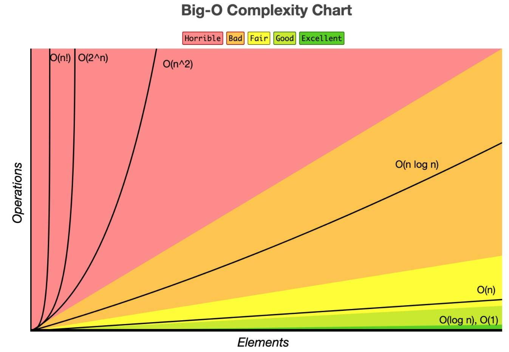

# Big O Notation

## Learning Objectives:
By the end of this lesson you will be able to:
- Understand what Big O is
- Understand time and space usage
- Calculate the effiency of an algorithm 
- Visually understand Big O rates of growth

## What is an algorithm?
- An algorithm is a just a series of steps. We've been using them all along. A for loop with instructions inside is an algorithm!

## What is Big O?
- It gives software engineers a way to describe the performance of a piece of code.
- If we have multiple implementations of a function, Big-O provides us a system for determining which code runs "best".
- "Best" means
    - Faster.
    - Less memory intensive (RAM usage / system memory)
- It is the mathematical expression of how long an algorithm takes to run depending on how long is the input, usually talking about the worst case scenario
- We care about worse case because one singular worst case can freeze (or near freeze) a device - also this could be our "normal" case
- We use Big O to classify alorithms by how they respond to changes in input size.
- Big-O allows us to talk more generally about the speed of code and in such a way where the speed of a computer doesn't factor in
- Instead of measuring actual time to determine speed (ie: "this code takes 2 seconds to run"), we count the number of operations the computer has to perform.

## What is efficiency?
- As a developer you need to be able to measure how taxing a given program is to a computer. The faster and lighter (less memory usage - RAM usage) the program, the less work the computer needs to do.

## Why do we care?
- As mentioned above, it's useful for discussing trade-offs between different approaches for solving a problem with code.
- An example scenario where this becomes useful, is when your program slows down or crashes, you now have a way of identifying parts of the code that are inefficient.

## Check the graph!



        These are the most commonly written complexities

    - O(1) -> Constant time: flat and constant no matter how much data you pass into the input
    - O(log n) -> Briefly jumps up but then flattens out.
    - O(n) -> Goes up and right in a straight line.
    - O(n^2) -> The larger the input the more it spkes up.

    Big O notation gives us a way of measuring the worst case scenario of how long a function will take given the input size. The rate of change given an increase of input size generally corresponds to one of these complexities. Note: we are only covering "time complexity" not "space complexity", which gives us a way to measure how much memory an algorithm takes. You would use the same notation for this measurement.

## ```console.(time)```
- One way you can look to see how long it takes your computer to run a certain piece of code is to use "console.time()". 
- WHOA, the console object has more methods than .log()?! Oh wait, yeah that makes sense. Remember, console is a JavaScript object, and one thing we should all know about objects at this point is that objects tend to have many properties and methods. Check the [documentation here](https://developer.mozilla.org/en-US/docs/Web/API/Console)!
- You can use console.time() at the beginning of your function and at the end in order to 'time' how long it's taking to execute on a given input.    
- Define your function with console.time() before and after the main operations within your function

```js
function quadraticTimeExample(arr){
    console.time("myTimer");
    const holdPairs = [];
    for(let i = 0; i < arr.length; i++){
        for(let j = 0; j < arr.length; j++){
            if(i !== j) holdPairs.push([arr[i], arr[j]]);
        }
    }
    console.timeEnd("myTimer");
    return holdPairs;
}
```
Run your function with an input:
```js
[5,4,3,2,1]
```
Which should output 
```js        
[[5,4], [5, 3], [5, 2], [5, 1]] 
```
- The timer for example may read 0.028076171875 ms
- Notice our timer output -> this is showing me how much time elapsed between when I started my timer and when I ended it.


# EXAMPLES

## O(1) is constant
- No matter how big the input, the computer will essentially do the same amount of work.
- Most mathematical operations are O(1) -> +, -, * etc.
- Assignment, return and accessing a value in an array or object are also O(1).

```js
function constantTimeExample(num){
    if(num <= 10){
        return num;
    } else {
        let num2 = num / .5 - 1;
        return num * num2;
    }
}
function constantTimeExample2(str, obj){
    // Looking to see if a key exits in an obj - returns a boolean value
    return obj[str] ? true : false;
}
```

## `O(n)` is `linear`
- The computer resources required grow proportionally to the size of the input
- An algorithm running at linear time will process each input at least once. Loops are a common example

```js
function linearTimeExample(arr){
    // Getting sum of array of numbers
    let output = 0;
    for(let i = 0; i < arr.length; i++){
        output += arr[i];
    }
    return output;
}
```

```js
// Another linear time example
let searchValue = 10;
const isValueThere = Object.values({someKey: 9, anotherKey: 10}).some(cur => cur === searchValue);
```

## `O(n^2)` is `quadratic`
- A functions run time is proportional to the square of the input size.
- For example, a function that has a loop running at `O(n)` becomes `O(n^2)` when that loops becomes nested within a loop that is also running at `O(n)`

```js
function quadraticTimeExample(arr){
    // Save every pair sequence possible of elements in an array
    // Sample input -> [5, 3, 1]
    // Expected output -> [[5, 3], [5, 1], [3, 5], [3, 1], [1, 5], [1, 3]]
    const holdPairs = [];
    for(let i = 0; i < arr.length; i++){
        for(let j = 0; j < arr.length; j++){
            if(i !== j) holdPairs.push([arr[i], arr[j]]);
        }
    }
    return holdPairs;
}
```

## `O(log n)` is `logarithmic`
- An algorithm that cuts the input size in half at each step is logarithmic.
```js
function logarithmicTimeExample(num) {
    // Sample input -> 8
    // Sample output -> [1, 2, 4, 8]
    const logStepsToN = [];
    for (let i = 1; i < num; i*=2) {
        logStepsToN.push(i);
    }
    return logStepsToN;
}
```
## Examples
- The answers are below each block of code
- Before looking at the answer try and decide on what its O(n) is
## Example one

```js
function exampleFunction(arr){
    let total = 0;
    for(let i = 0; i < arr.length; i++){
        total += arr[i];
    }
    for(let i = 0; i < arr.length; i++){
        if(arr[i] / 2 < i){
            total -= arr[i] / 2;
        }
    }
    
    return total;
}
```
>- The prior function loops over an array and adds each value to the total
>- It then loops over the array and removes half of each value from the total
>The first loop is 0(n), and so is the second therefore this is 0(2n)
>- Which factors down to O(n), the 2 is neglegible 
>- n === number of elements (aka) size of input
## 0(log n)
```js
function binarySearch(arr, key){
    let start = 0;
    let end = arr.length - 1;
    while(start <= end){
        let middle = Math.floor((start + end) / 2);
        if(arr[middle] === key){
            return key + ' is at index ' + middle;
        }else if(arr[middle] < key){
            start = middle + 1;
        } else {
            end = middle - 1;
        }
    }
    return -1;
}
```
- Binary Search is a pretty well know algorithm
- The prior function searches for a number by splitting a sorted array in half and saying "does the number fall within this range?"
- It then repeats these two steps over and over until it finds the number
- As a result of splitting the array in half the search time is logarithmic, 0(log n). 


// I am getting the example functions below from the following article:
// https://medium.com/analytics-vidhya/big-o-notation-time-complexity-in-javascript-f97f356de2c4

```js
function exampleFunction3(arr){
    for(let i = 0; i < arr.length; i++){
        console.log(`Element of array is ${arr[i]}`);
    }
    return null;
}
```
- This function loops over the array making one log per element
- O(n) - linear time

```js
function exampleFunction4(arr){
    console.log(`First Element of array is ${arr[0]}`);
    return null;
}
```
- No matter the size of the array it will always just grab the first element 
- O(1) - constant time
```js
function bubbleSort(arr){
    for(let i = 0; i < arr.length; i++){
        for(let j = i + 1; j < arr.length; j++){
            if(arr[i] > arr[j]){
                let temp = arr[i];
                arr[i] = arr[j];
                arr[j] = temp;
            }
        }
    }
    return arr;
}
```
- The prior example is a sorting algorithm
- Sorting is notoriously difficult and slow
- Bubble sort is a well-known algorithm
- This algo is 0^2
- Bubble sort compares adjacent elements, it starts with the first two elements and it swaps them if the first element is larger than the second element. it repeats the same steps until it reaches the end of the array. The same steps will repeat from the i+1 element.

# Lets Practice!
complete 0-big-o-notation-practice.js
```js
function loopAndPrint(arr){
    for(let i = 0; i < arr.length; i++){
        console.log(arr[i]);
    }
}
```
- This function just loops and prints each value
- Therefore it is just 0(n)
/* More Examples */

// const newArry = [5,2,3,5]

/* 
    Linear time - O(n):

    
*/

// // loopAndPrint(newArry);

// const nesetedArr = [[1,2],[3,4],[5,6,7]];

/*
    Constant time - O(1):
        This is the fastest operation you can perform.
*/

var background = new Image();
background.src = "https://bit.ly/3nrHReU";
// Make sure the image is loaded first otherwise nothing will draw.
background.onload = function(){
    ctx.drawImage(background,0,0);   
}